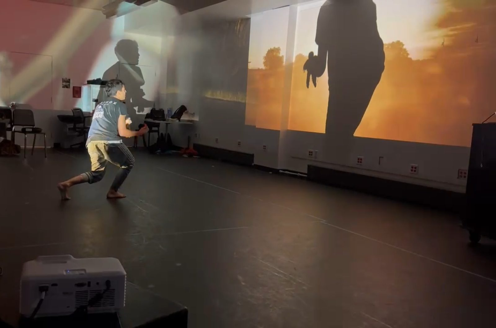
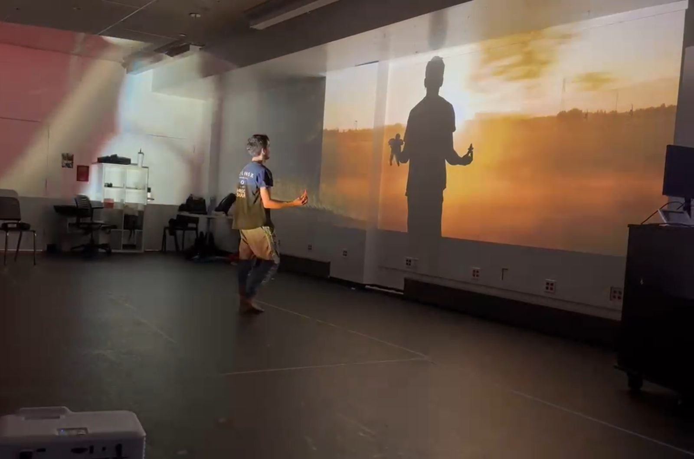
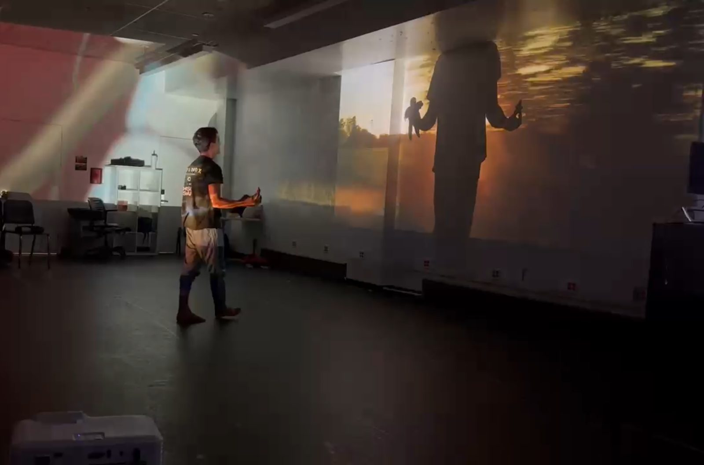

# Five Dimensions

A live performance built from the archival and oral history material I've been
collecting about my family's relation to the Second World War, in Germany and Romania.
Four walls
of video carry four voices that never shared a room. I stand in the middle as the
fifth, and the room, the audience and a phone call to a relative who has died decide
what happens next.

**Status:** proposal · Week 7 of 15
**Course:** PSAM 5600 B, Small Linux Devices, Large Language Models
Parsons School of Design, Fall 2026

> ⚠️ The show doesn't run yet. Parts of it do: see *Where it stands*.



## What it is

My family lived through the Second World War in Germany and Romania: one as a child, one as a teenage soldier,
one who came back and mostly kept silent. This year I broke the silence and
interviewed those who were open to it. They left hours of recorded conversation,
hundreds of letters from the front, photos, and gaps. Now everyone who lived through
that time is dead, and the younger generations don't talk, or don't function. Nobody
in my family can sit in one room and go through it together.

So I'm building the room. Everything goes into one place, **the Pot**. A machine
transcribes, translates and dates it, and turns every piece into a fragment that
points back to its recording minute or letter page. On stage, each projection channel
belongs to one voice. The fifth dimension is me, live, asking the questions I didn't
dare to ask. Or is it us? The audience is in the room too, and we all become
performers.

No two performances are alike: the system reads the room it is in and responds. I
intend this as avant garde work, and collaborating with AI openly rather than quietly
is part of the provocation.

## How it works

1. **The Pot (before the show).** Recordings, letters and photos go in raw and come
   out as cited fragments, German and English. A large model does the synthesis ahead
   of time; on stage, a small self-hosted model may only *choose* a fragment I already
   approved.
2. **The room (Isadora on the MacBook).** A camera counts the faces in the audience
   and follows my body. More people, more voices. My movement moves the video across
   the four channels; tilting the Nokia N900 in my hand shifts the whole projection.
3. **The call (N900 + Raspberry Pi 5).** The N900 becomes a phone again. It rings, I
   pick up, and the Pi listens to what I say. A relative who has died answers in a
   voice reconstructed from the little he recorded, speaking freely.

If anything is slow, confused or offline, the current cue holds and the show goes on.

## The three devices

| Device | Role |
|---|---|
| **MacBook Pro M4 Max** | Isadora renders the four channels, reads the camera, speaks the reconstructed voice. |
| **Nokia N900** (2009) | The body and the phone: tilt to move the projection, pick up to make the call. From the course's Nokia Devices Library. |
| **Raspberry Pi 5** (16 GB) | The ears and the go-between: hears me, asks the model, sends cues to the Mac. |

The Pi 5 and the N900 are both small Linux devices, sixteen years apart. The Pi has
the power, the N900 has the body.

## Care

I'm reading on this alongside the work, and I invite discussion. I want to push
boundaries, I accept that I might cross some, and I don't yet know whether I want to
keep working this way. The rules below are where I stand today.

- **Consent.** One recording was made without asking, and I can no longer ask. The
  others agreed to be interviewed. Everyone who lived through that time has died; the
  family that remains decides what goes in.
- **The reconstructed voice.** A machine speaks as a relative who has died and says
  things he never said. The audience is told before it happens.
- **Privacy.** Transcription stays on my computer. Any cloud upload is a per-material
  choice, never a default.
- **Showing.** My family hears it before an audience does. No names in public,
  including here. The archive is never published; this repo holds code and
  documentation only.

## Where it stands (Week 7)

- **Four-channel projection works** in Isadora and reacts to me: the camera reads the
  room, counts faces, and sends cues.
- **Isadora takes cues over the network**, tested from a second computer.
- **The Pi 5 is on Wi‑Fi.** Its first script, which sends cues to Isadora, is in this
  repo (see *Setup*) but hasn't run on the Pi yet.
- The archive is collected but not yet organized.

| | |
|---|---|
|  |  |

## Not yet

- The N900 isn't charged or connected: no tilt, no game, no call.
- The Pi has no microphone or camera, and nothing on it talks to the Mac yet.
- No performance room yet; the projector setup depends on it.

## Next steps

- [ ] Organize the archive into the Pot: inventory, then a pilot with one recording and ten letters
- [ ] Run `pi/hello_isadora.py` on the Pi and see the cues arrive in Isadora
- [ ] Give the Pi ears: a clip-on microphone and offline speech-to-text
- [ ] Charge the N900, read its tilt sensor, use it in Isadora
- [ ] Build the call: N900, Pi and Mac talking to each other
- [ ] Bring in my 6K footage of birds and roads in Bucharest
- [ ] Find the room, then plan the projectors around it

## Setup

**First link: the Pi sends cues to Isadora over Wi‑Fi**
([`pi/hello_isadora.py`](pi/hello_isadora.py), standard-library Python).

1. On the Mac, in Isadora: add an **OSC Listener**, OSC input on port 1234.
2. On the Pi, on the same Wi‑Fi as the Mac:
   ```
   git clone https://github.com/Grossi-thisisforyou/five-dimensions
   cd five-dimensions/pi
   python3 hello_isadora.py MAC_IP_ADDRESS
   ```
3. The Pi prints `sent cue 1 … 4`; Isadora receives `/fivedim/cue`, one number per channel.

## Co-authorship

Developed with AI models, named explicitly, as course policy and as method.

- **Claude Opus 5:** setup, repository structure, first documentation
- **Claude Opus 5.5:** Week 7 update (how it works, care, status, first Pi script)
- **Claude Fable 5.1:** Week 7 README rework

Commits carry `Co-Authored-By:` trailers naming the model that contributed.

## License

[MIT](LICENSE). Anyone may use, modify and build on this work provided the copyright
notice is kept.
